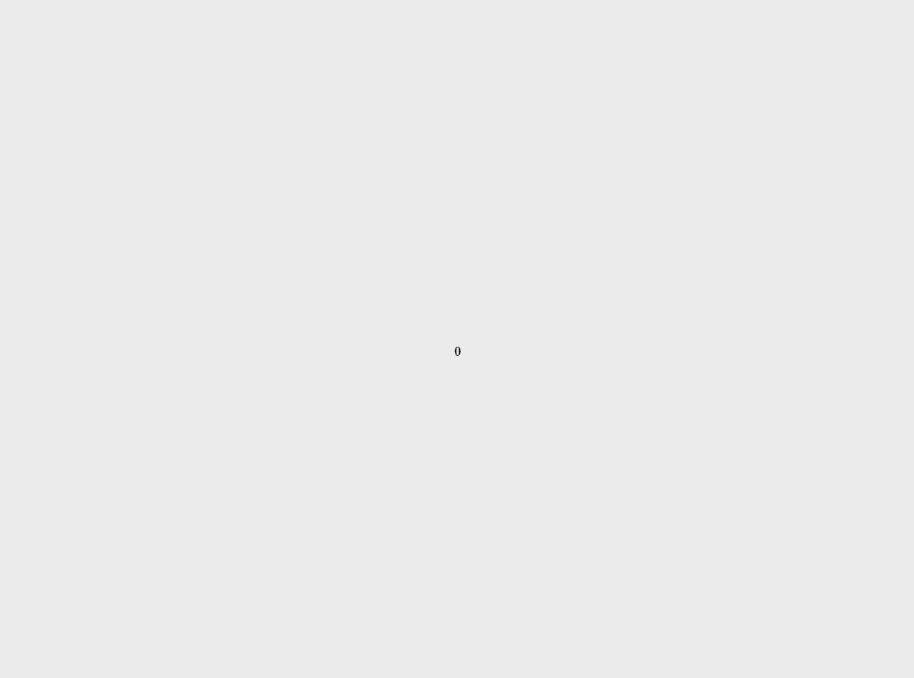

# DAY_012 | Scroll Animations

This project is part of the daily code challenge series, **DAY_012**, where I explore an **Awwwards' Site of the Month**. In this project, I recreate captivating **scroll animations** using **HTML**, **CSS**, **JavaScript**, and **GSAP ScrollTrigger**. The design is inspired by the scroll-triggered animations seen on the **Zajno Digital Studio** website.

## Inspiration

Inspired by **Zajno Digital Studio's** design approach to **scroll-triggered animations**.  
Check it out here: [Zajno Digital Studio](https://zajno.com/)

---

## Project Preview



## Zajno Digital Studio


---

## GSAP ScrollTrigger in Action

### What is GSAP?

**GSAP (GreenSock Animation Platform)** is a powerful JavaScript library used to create high-performance animations. It enables smooth, complex animations for websites and applications without compromising performance. **ScrollTrigger** is a GSAP plugin that allows animations to be triggered based on the user's scroll behavior, offering more immersive, responsive animations.

### How ScrollTrigger is Used in This Project

In **DAY_012**, the animations are all driven by **GSAP ScrollTrigger**, which monitors the user's scroll progress and triggers animations as specific elements come into view. This allows for dynamic effects such as text shifting, images scaling, and overall page elements transforming based on scroll interaction.

#### Key Concepts

1. **Scroll-Triggered Animations**: Elements animate as they come into view or reach specific scroll points.
2. **Scrubbing**: The animations are linked to the scroll progress, so the user controls the animation timeline by scrolling.
3. **Ease Functions**: The animations use easing functions (e.g., `power4.inOut`) to create smooth transitions, preventing abrupt starts and stops.

---

## Detailed Breakdown of the JavaScript

### Setting up ScrollTrigger with GSAP

The animations in **DAY_012** are created with **GSAP ScrollTrigger**, which listens for the scroll events and adjusts elements' properties based on the scroll position.

#### Example JavaScript Code

```javascript
document.addEventListener("DOMContentLoaded", function () {
  gsap.registerPlugin(ScrollTrigger);

  // Animate the header text when the page loads
  gsap.to(".header h1 span", {
    y: 0,
    stagger: 0.1,
    duration: 2,
    ease: "power4.inOut",
    delay: 0.75,
  });

  // Scroll-triggered animation for the hero image
  ScrollTrigger.create({
    trigger: ".hero",
    start: "top center", // Trigger point when the top of the .hero element reaches the center of the viewport
    end: "bottom center", // End point when the bottom of the .hero element reaches the center of the viewport
    scrub: true, // Links the animation to the scroll progress (scrubbing effect)
    onEnter: () => {
      gsap.to(".hero-img img", {
        scale: 1, // Scale the hero image to normal size
        duration: 2.25,
        ease: "power3.inOut",
      });
    },
  });

  // Dynamic gap adjustment between text elements during scroll
  document.querySelectorAll(".row").forEach((row) => {
    ScrollTrigger.create({
      trigger: row,
      start: () => `top+=${getStickyBarCenter() - 550} center`,
      end: () => `top+=${getStickyBarCenter() - 450} center`,
      scrub: true,
      onUpdate: (self) => {
        const progress = self.progress;
        const maxGap = window.innerWidth < 900 ? 10 : 15;
        const minGap = window.innerWidth < 900 ? 0.5 : 1;
        const currentGap = minGap + (maxGap - minGap) * progress;
        row.style.gap = `${currentGap}em`; // Adjust the gap dynamically based on scroll progress
      },
    });
  });

  // Footer animation: adjust font size and position based on scroll
  ScrollTrigger.create({
    trigger: ".footer",
    start: "top bottom",
    end: "bottom bottom",
    scrub: true,
    onUpdate: (self) => {
      const fontSizeStart = window.innerWidth < 900 ? 2.5 : 1.25;
      const fontSizeEnd = 9;
      const newFontSize =
        fontSizeStart + (fontSizeEnd - fontSizeStart) * self.progress;
      document.querySelector(".sticky-bar p").style.fontSize = `${newFontSize}vw`;
    },
  });
});
```

### Key Animations

1. **Header Text Animation**:
   - This part of the code uses **GSAP** to animate the header text (`.header h1 span`), which enters the viewport by sliding up (`y: 0`) with a slight stagger to create a fluid text reveal.
   - **Stagger**: The stagger property creates a delay between each character's animation, making the text appear in a sequence rather than all at once.

2. **Hero Image Animation**:
   - The `.hero-img` scales from a smaller size to its full size as the user scrolls through the hero section, creating a zoom-in effect as the image comes into view.
   - The **scrub** option ensures that the animation's progress is tied to the scroll, so the image scales smoothly in response to the user's scroll position.

3. **Dynamic Gap Adjustment**:
   - This part adjusts the gap between elements in `.row` based on the user's scroll progress, making the page layout more dynamic and interactive as the elements shift and re-align.

4. **Footer Animation**:
   - As the user scrolls to the bottom of the page, the footer text grows in size, providing a subtle visual cue that the user has reached the end of the content.

---

## How to Run

1. **Clone the repository**:

   ```bash
   git clone https://github.com/thounny/DAY_012.git
   ```

2. **Navigate to the project directory**:

   ```bash
   cd DAY_012
   ```

3. **Open the `index.html` file** in your web browser:

   - You can double-click the file in your file explorer, or
   - Serve it using a local development server (e.g., Live Server in VSCode).

---

## Project Structure

```bash
DAY_012/
│
├── assets/
│   └── favicon.ico
│   ├── logo1.png
│   ├── 1.gif
│   ├── DAY_012_1.gif
│   ├── DAY_012_2.gif
├── helveticaneue.woff2
├── styles.css
├── index.html
└── script.js
```

---

## Features

- **Scroll-Triggered Animations**: The text and images move in response to user scroll, creating a sleek, interactive visual experience.
  
- **GSAP ScrollTrigger**: This project leverages **GSAP ScrollTrigger** for smooth, customizable scroll animations.

---

## Technologies Used

- **HTML5**: For structuring the document.
- **CSS3**: For layout and styling of the project.
- **JavaScript (ES6)**: For handling interactivity and animations.
- **GSAP (GreenSock Animation Platform)**: For creating smooth, scroll-triggered animations.

---

## Author


**Thounny Keo**  
Frontend Development Student | Year Up United

---

